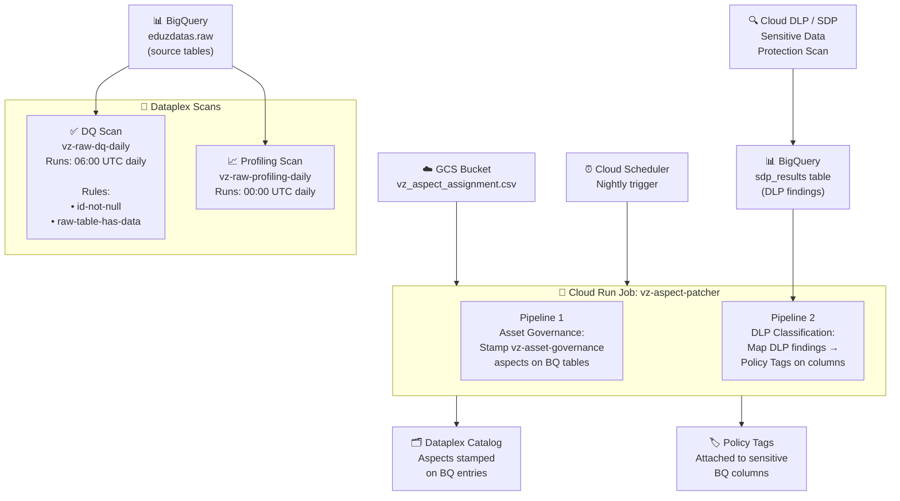

# VZ Data Governance — GCP Knowledge Catalog

> Automated metadata governance, data profiling, and data quality scanning for BigQuery using Google Cloud Dataplex — managed as Infrastructure-as-Code via Terraform.

---

## Overview

This repository provisions and manages the **VZ Data Governance** pipeline on Google Cloud Platform. It automates three key capabilities:

1. **Asset Governance** — Stamping every BigQuery table with structured metadata (owner, domain, lifecycle stage) via Dataplex Aspects
2. **Data Quality** — Running automated rule-based checks against table contents on a daily schedule
3. **Data Classification** — Detecting sensitive columns (PII, financial data) using DLP and attaching BigQuery Policy Tags to physically restrict access

---

## Architecture



---

## Module Structure

```
vz/
├── .gitignore
├── README.md
│
├── custom_modules/
│   ├── dataplex_aspect_type/      # Creates custom Dataplex aspect type schemas
│   ├── dataplex_datascan/
│   │   ├── data-profiling/        # Data profiling scan (column stats, nulls, cardinality)
│   │   └── data-quality/          # Data quality scan (rule-based checks)
│   ├── dataplex_sdp/              # Sensitive Data Protection discovery config
│   ├── cloudrun_aspect_patcher/   # Cloud Run Job + Cloud Scheduler definition
│   └── iam_custom_roles/          # Least-privilege custom IAM role template
│
├── envs/
│   └── dev/
│       ├── dataplex.tf            # Aspect types, profiling + DQ scans
│       ├── cloudrun.tf            # Cloud Run job definition
│       ├── variables.tf           # Input variables
│       ├── terraform.tfvars       # Dev environment values
│       └── dq_rules_template.tf   # 📋 Copy-paste library of all 9 DQ rule types
│
└── scripts/
    └── cloudrun/
        └── aspect_patcher/        # Python app running inside Cloud Run
            ├── main.py            # Orchestrator (Pipeline 1 + Pipeline 2)
            ├── Dockerfile
            ├── requirements.txt
            └── classify/          # DLP classification sub-pipeline
                ├── identify_scope.py
                ├── update_recommended_classification.py
                ├── update_dataplex_aspect.py
                └── attach_policy_tags.py
```

---

## Data Quality Rules

The DQ scan module supports **9 built-in rule types**. All examples are in [`envs/dev/dq_rules_template.tf`](envs/dev/dq_rules_template.tf) — copy from there into your scan's `dq_rules` list.

| # | Rule Type | Use Case | Dimension |
|---|---|---|---|
| 1 | `non_null_expectation` | Column must never be empty | COMPLETENESS |
| 2 | `uniqueness_expectation` | No duplicate values in column | UNIQUENESS |
| 3 | `range_expectation` | Values must be between X and Y | VALIDITY |
| 4 | `regex_expectation` | Values must match a pattern (email, phone) | VALIDITY |
| 5 | `set_expectation` | Values must be from a defined list | VALIDITY |
| 6 | `statistic_range_expectation` | Column average/max must be within range | ACCURACY |
| 7 | `row_condition_expectation` | Custom SQL evaluated per row | CONSISTENCY |
| 8 | `table_condition_expectation` | Custom SQL evaluated on whole table | COMPLETENESS |
| 9 | `sql_assertion` | Full SQL query — passes if 0 rows returned | CONSISTENCY |

> **Note:** Rules of type `table_condition_expectation` and `sql_assertion` do not accept a `threshold` value. The module handles this automatically.

### Example: Adding a Rule to a Table

```hcl
module "dq_scan_raw" {
  source       = "../../custom_modules/dataplex_datascan/data-quality"
  data_scan_id = "vz-raw-dq-daily"
  dq_rules = [
    # Built-in: column must not be null
    {
      name                 = "customer-id-not-null"
      dimension            = "COMPLETENESS"
      column               = "customer_id"
      non_null_expectation = true
    },
    # Custom SQL: table must have data
    {
      name                = "table-not-empty"
      dimension           = "COMPLETENESS"
      table_condition_sql = "COUNT(*) > 0"
    }
  ]
}
```

---

## IAM

All IAM permissions for the `vz-datacatalog` service account are provisioned by the **Security team** via GCP Console tickets (not managed by this Terraform codebase).

The custom least-privilege role template for Policy Tag attachment lives in `custom_modules/iam_custom_roles/` for reference. It defines a `policyTagStamper` role with only:
- `bigquery.tables.get`
- `bigquery.tables.update`
- `bigquery.tables.setCategory`

---

## Deployment

```bash
cd envs/dev

# Initialize
terraform init

# Preview changes
terraform plan

# Apply
terraform apply -auto-approve
```

---

## Scans Currently Deployed

| Scan ID | Type | Table | Schedule |
|---|---|---|---|
| `vz-raw-profiling-daily` | Profiling | `vzdataset.raw` | Daily 00:00 UTC |
| `vz-raw-dq-daily` | Data Quality | `vzdataset.raw` | Daily 06:00 UTC |
| `vz-raw-dq-profile-based` | DQ (Profile Recommendations) | `vzdataset.raw` | Daily 06:00 UTC |

---

## Aspect Types

| Aspect Type ID | Purpose | Fields |
|---|---|---|
| `vz-asset-governance` | Table-level governance metadata | `data_owner`, `data_domain`, `lifecycle_stage` |
